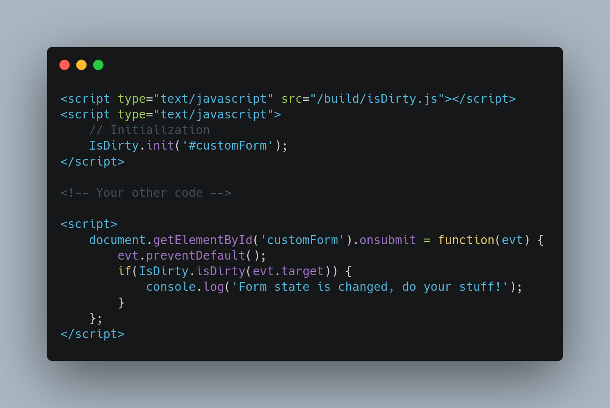

<div id="top"></div>


[](https://github.com/kalizi/isDirtyVanilla/stargazers)
[](https://github.com/kalizi/isDirtyVanilla/network)
[](https://github.com/kalizi/isDirtyVanilla/issues)
[](https://github.com/kalizi/isDirtyVanilla/blob/main/LICENSE)


<!-- PROJECT LOGO -->
<div align="center">
  <a href="https://github.com/kalizi/isDirtyVanilla">
    
  </a>

  <h1 align="center">isDirtyVanilla</h1>

  <p align="center">
    A little utility to check if a form state is changed and it's dirty.
    <br />
    <a href="https://github.com/kalizi/isDirtyVanilla"><strong>Explore the docs »</strong></a>
    <br />
    <br />
    <a href="https://github.com/kalizi/isDirtyVanilla">View Demo</a>
    ·
    <a href="https://github.com/kalizi/isDirtyVanilla/issues">Report Bug</a>
    ·
    <a href="https://github.com/kalizi/isDirtyVanilla/issues">Request Feature</a>
  </p>
</div>


<!-- TABLE OF CONTENTS -->
<details>
  <summary>Table of Contents</summary>
  <ol>
    <li>
      <a href="#about-the-project">About The Project</a>
      <ul>
        <li><a href="#built-with">Built With</a></li>
      </ul>
    </li>
    <li>
      <a href="#getting-started">Getting Started</a>
      <ul>
        <li><a href="#installation">Installation</a></li>
      </ul>
    </li>
    <li><a href="#api">API</a></li>
    <li><a href="#roadmap">Roadmap</a></li>
    <li><a href="#contributing">Contributing</a></li>
    <li><a href="#license">License</a></li>
    <li><a href="#contact">Contact</a></li>
    <li><a href="#acknowledgments">Acknowledgments</a></li>
  </ol>
</details>


<!-- ABOUT THE PROJECT -->
## About The Project

[](https://github.com/kalizi/isDirtyVanilla)


<p align="right">(<a href="#top">back to top</a>)</p>


### Built With

* [form-serialize](https://www.npmjs.com/package/form-serialize): to serialize form state.
* [Webpack](https://webpack.js.org/)
* [Babel](https://babeljs.io/)
* [Jest](https://jestjs.io/)

<p align="right">(<a href="#top">back to top</a>)</p>


<!-- GETTING STARTED -->
## Getting Started

To get a local copy up and running follow these simple steps.

1. Clone the repo
  ```sh
  git clone https://github.com/kalizi/isDirtyVanilla.git
  ```
2. Install packages
  ```sh
  yarn
  ```
3. Edit files
4. Run tests
  ```sh
  yarn test
  ```
5. Build the project
  ```sh
  yarn start
  ```

<p align="right">(<a href="#top">back to top</a>)</p>

## `API`

#### `init(targets = [])`

`init` method receives an array or a single target containing inputs whose states needs to be tracked.

**Throws:** 

* `Error("No targets supplied")`: if empty array given.
* `Error("Invalid query selector supplied")`: if wrong selectors passed in.

#### `isDirty(form)`

`isDirty` method returns true if the state of the form passed in changed, false otherwise.

**Throws:** 

* `Error("Invalid form supplied")`: if parameter is not a valid element or is not tracked.

#### `isDirtyBySelector(form, selector)`

`isDirtyBySelector` method returns true if the state of the input for the form passed in changed, false otherwise.

**Throws:** 

* `Error("Invalid form supplied")`: if first parameter is not a valid element or is not tracked.
* `Error("Invalid selector supplied")`: if second parameter is an empty string or null.
* `Error("Selector gave no result.")`: if provided selector gives no result for the form passed in.


<p align="right">(<a href="#top">back to top</a>)</p>


<!-- ROADMAP -->
## Roadmap

- [ ] Add API to get changed inputs

See the [open issues](https://github.com/kalizi/isDirtyVanilla/issues) for a full list of proposed features (and known issues).

<p align="right">(<a href="#top">back to top</a>)</p>


<!-- CONTRIBUTING -->
## Contributing

Contributions are what make the open source community such an amazing place to learn, inspire, and create. Any contributions you make are **greatly appreciated**.

If you have a suggestion that would make this better, please fork the repo and create a pull request. You can also simply open an issue with the tag "enhancement".
Don't forget to give the project a star! Thanks again!

1. Fork the Project
2. Create your Feature Branch (`git checkout -b feature/AmazingFeature`)
3. Commit your Changes (`git commit -m 'Add some AmazingFeature'`)
4. Push to the Branch (`git push origin feature/AmazingFeature`)
5. Open a Pull Request

<p align="right">(<a href="#top">back to top</a>)</p>


<!-- LICENSE -->
## License

Distributed under the MIT License. See `LICENSE.txt` for more information.

<p align="right">(<a href="#top">back to top</a>)</p>

<!-- CONTACT -->
## Contact

Kalizi - [@kalizi_dev](https://twitter.com/kalizi_dev) - <a href="mailto:me@kalizi.dev">me@kalizi.dev</a>

Project Link: [https://github.com/kalizi/isDirtyVanilla](https://github.com/kalizi/isDirtyVanilla)

<p align="right">(<a href="#top">back to top</a>)</p>


<!-- ACKNOWLEDGMENTS -->
## Acknowledgments

* [Best README Template](https://github.com/othneildrew/Best-README-Template/)

<p align="right">(<a href="#top">back to top</a>)</p>
